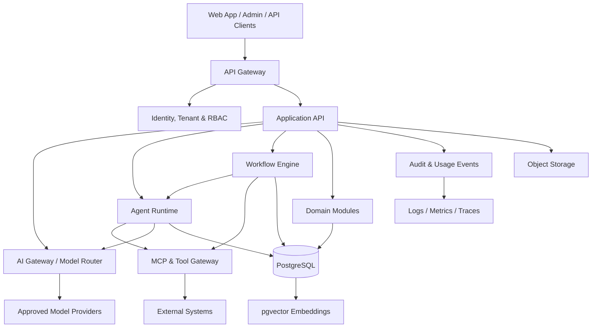

# HireSaathi AI — Architecture Design

**Status:** Architecture baseline for implementation  
**Product principle:** One unified, multi-tenant AI business platform—not separate disconnected products.

## 1. Product scope

HireSaathi AI brings these capabilities into one workspace:

1. **AI Core** — model gateway, prompt/version management, structured outputs, usage tracking, evaluation and provider routing.
2. **AI Agents** — reusable agent templates, tool permissions, memory/context, run history and human approval.
3. **AI Marketing** — Brand IQ, content studio, campaigns, calendar, approvals, assets, channel integrations and analytics.
4. **AI Hiring** — roles, candidate pipeline, resumes, interview workflows and recruiter assistance. Human decision-making remains in control of consequential hiring decisions.
5. **AI Support** — knowledge base, conversations, ticket routing, suggested responses and human handoff.
6. **Business Automation** — event-triggered and scheduled workflows, conditions, retries, logs and approval gates.
7. **AI Builder** — controlled app/prototype creation with preview, versioning and sandboxed execution.
8. **MCP & Integrations** — governed connections to approved external tools and MCP servers.
9. **Workspace & Admin** — users, roles, tenants, plans, audit events, usage and platform settings.

## 2. High-level architecture



## 3. Recommended implementation approach

Start with a **modular monolith** and separate background workers. Keep domain boundaries explicit in code; split services only when scale, ownership or operational needs justify it. This avoids premature distributed-system complexity while preserving a path to service extraction.

### Logical components

- **Web client:** React, TypeScript, Vite (existing frontend baseline).
- **Backend API:** Python FastAPI, typed request/response contracts and OpenAPI.
- **Identity and access:** OIDC/OAuth-compatible identity, secure sessions, tenant-aware RBAC.
- **Primary data:** PostgreSQL with migrations; use pgvector for retrieval where appropriate.
- **Async jobs:** Redis-backed queue/worker initially; idempotency, retry and dead-letter handling.
- **AI gateway:** provider adapters, model allowlist, timeouts, rate limits, cost/token metering and fallbacks.
- **Agent runtime:** shared runner driven by versioned configurations; agents are templates + tools + policies, not separate bespoke services.
- **Workflow engine:** versioned nodes, triggers, conditions, approval steps, execution state and retry policy.
- **MCP gateway:** server allowlist, tool schemas, per-tenant authorization, credential isolation and outbound network controls.
- **File storage:** S3-compatible object storage for uploaded assets, generated exports and documents.
- **Observability:** structured logs, traces, metrics, audit records and alerts.

## 4. Suggested monorepo structure

```text
hiresaathi/
  apps/
    web/                    # existing React app; migrate/organize incrementally
    admin/
  services/
    api/                    # FastAPI application and domain routers
    worker/                 # asynchronous jobs
  packages/
    contracts/              # shared API/event schemas
    agent-catalog/          # reusable, versioned agent templates
    integrations/           # provider and external integration adapters
  backend/
    app/
      api/
      core/                  # configuration, security, logging
      identity/
      tenants/
      ai_gateway/
      agents/
      workflows/
      marketing/
      recruiting/
      support/
      builder/
      mcp/
      billing/
      audit/
      database/
      storage/
    migrations/
    tests/
  infra/
    docker/
    deployment/
    observability/
  docs/
    architecture/
    decisions/
    security/
    api/
    runbooks/
  .env.example
  docker-compose.yml
  README.md
```

This is a target structure, not a claim that all directories or services are already implemented.

## 5. Core data model

Use tenant-scoped records throughout. Core entities include:

- `tenants`, `users`, `memberships`, `roles`, `permissions`
- `projects`, `agent_templates`, `agent_versions`, `agent_runs`, `tool_calls`
- `model_providers`, `model_configs`, `usage_events`
- `workflow_definitions`, `workflow_versions`, `workflow_runs`, `workflow_steps`
- `brands`, `brand_guidelines`, `content_items`, `campaigns`, `approvals`, `assets`, `publishing_jobs`
- `jobs`, `candidates`, `applications`, `interview_records`
- `support_conversations`, `tickets`, `knowledge_documents`
- `integration_connections`, `mcp_servers`, `audit_events`

Every tenant-owned table should include a tenant key, appropriate foreign keys, timestamps and deletion/retention strategy. Enforce tenant isolation in authorization checks and preferably with PostgreSQL row-level security where practical.

## 6. Example request lifecycles

### AI agent run
1. Authenticate user and resolve tenant.
2. Authorize access to agent, project and requested tools.
3. Load an immutable agent version and applicable tenant context.
4. Ask the AI gateway for a response using the selected provider/model policy.
5. Route tool calls through the MCP/tool gateway; validate each schema and permission.
6. Require approval for configured high-impact or external side effects.
7. Persist run status, sanitized inputs/outputs, usage and audit events.
8. Return result and trace/run ID to the client.

### Marketing publishing
1. Create a draft using Brand IQ context.
2. Validate the platform-specific content and media requirements.
3. Move through configured reviewer approvals.
4. Queue publishing only after valid authorization and approval.
5. Use platform OAuth credentials from a secrets store; never expose them to the browser or model.
6. Record provider response, publish status and analytics where APIs permit.

## 7. Security and trust boundaries

- **Tenant isolation:** tenant-scoped access checks at every API and job boundary.
- **Secrets:** store provider keys and OAuth tokens in a secrets manager; encrypt at rest and rotate.
- **Tool security:** explicit tool allowlists, least privilege, schema validation, egress controls, timeouts and quotas.
- **Prompt injection:** treat retrieved documents and tool output as untrusted data; never let content override system policy or grants.
- **Human approval:** required for public posts, external messages, destructive operations and other consequential actions as configured.
- **Hiring safeguards:** AI assists with organization and summaries; it must not autonomously make final employment decisions.
- **Privacy:** minimization, retention/deletion policies, export paths and sensitive-data redaction.
- **Auditability:** actor, tenant, action, target, timestamp, outcome and request/run correlation ID.
- **Reliability:** idempotency keys, retry ceilings, rate limits, backups and restore drills.

## 8. API boundary examples

Illustrative versioned API surface:

- `POST /api/v1/agent-runs`
- `GET /api/v1/agent-runs/{run_id}`
- `GET|POST /api/v1/agents`
- `GET|POST /api/v1/workflows`
- `POST /api/v1/workflows/{workflow_id}/runs`
- `GET|POST /api/v1/brands`
- `GET|POST /api/v1/content`
- `POST /api/v1/content/{content_id}/approvals`
- `GET|POST /api/v1/jobs`
- `GET|POST /api/v1/support/tickets`
- `GET|POST /api/v1/integrations`

All endpoints must authenticate and enforce tenant-level authorization. The list describes a target contract, not currently deployed endpoints.

## 9. Implementation phases

### Phase A — Foundation
Repository hygiene, environment config, backend skeleton, PostgreSQL migrations, identity, tenant/RBAC foundation, health checks, CI and structured observability.

### Phase B — AI Core
Model provider adapters, key management, model routing, agent templates and versions, run persistence, token/cost metering, evaluation tests.

### Phase C — Workflow + MCP
Queue workers, workflow definitions and runs, tool registry, approved MCP connections, scoped credentials, approvals and audit trail.

### Phase D — Domain modules
Connect Marketing, Hiring and Support screens to persisted APIs. Add storage, review states, notifications and module-specific permissions.

### Phase E — Builder + analytics + operations
Sandboxed preview/build pipeline, tenant usage and billing hooks, dashboards, backup/restore tests, performance and security testing.

### Phase F — Production readiness
Threat-model review, data-retention verification, rate-limit/load testing, incident runbooks, staging validation, gradual rollout and monitoring.

## 10. Definition of done

A feature is not production-ready merely because its UI exists. It should have API contracts, authorization and tenant-isolation tests, durable persistence, validation and error states, telemetry/audit events, automated tests, operational documentation and explicit handling of secrets and external side effects.

## Current repository note

The current repository README describes a React/TypeScript frontend with demonstration/mock data. Backend APIs, database persistence, authentication/authorization, live AI provider calls and real social publishing are not yet included. This document records the architecture target and must be updated as implementation and verification progress.
